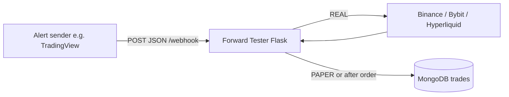

# TRW Forward Tester

A small **Flask webhook service** that receives JSON alerts (typically from **TradingView**), optionally places **real** futures orders on **Binance**, **Bybit**, or **Hyperliquid**, and **persists every event** (paper or real) to **MongoDB** for analysis. A separate **Streamlit dashboard** reads the same database to visualize performance.

The app does **not** implement strategy logic: entries, exits, sizing rules, and paper vs live are decided in Pine Script (or whatever sends the webhook). This service only **validates**, **normalizes quantity**, **routes to an exchange**, and **records** the outcome.

---

## How it works (end-to-end)

1. **Something POSTs JSON** to `POST /webhook` on your server (port **5000** by default in `app.py`).
2. **IP check**: the client IP must appear in `WHITELISTED_IPS` or the request gets **403** (TradingView and many relays use fixed outbound IPs—whitelist those).
3. **Parse JSON**: invalid or empty body returns **400**; otherwise `execute_order` runs.
4. **Quantity rules**: ticker symbols are normalized (e.g. `.P` stripped, `USD` → `USDT` style suffix). `config.py` can enforce **minimum quantity** and **decimal precision** per symbol before any order.
5. **`order_type`**:
   - **`PAPER`** (default if omitted): no exchange call; the event is still **logged to MongoDB** with `order_response` as `null`.
   - **`REAL`**: the **`exchange`** field must be **`BINANCE`**, **`BYBIT`**, or **`HYPERLIQUID`** (case-insensitive in practice because values are uppercased). The matching `place_order_*` runs; credentials come from **environment variables** (see below). Wrong or missing `exchange` for `REAL` fails with an error and HTTP **500**.
6. **MongoDB**: each handled payload is inserted into database **`trading`**, collection **`trades`**, with strategy metadata, side, quantity, leverage, etc.



---

## Project layout

| Piece | Role |
|--------|------|
| `app.py` | Flask app: `/webhook`, `execute_order`, Mongo writes |
| `exchanges/` | `place_order_*` per venue (Binance futures, Bybit linear, Hyperliquid via CCXT) |
| `config.py` | `minQtyDict`, `precisionDecimalDict` for per-symbol clamps |
| `webhook_format.json` | Example JSON shape for alert messages |
| `dashboard/dashboard.py` | Streamlit UI: loads `trades` from MongoDB, charts and aggregates |

---

## Webhook payload (what the app reads)

Use `webhook_format.json` as a template. Important fields:

| Field | Purpose |
|--------|---------|
| `order_type` | `PAPER` or `REAL` |
| `exchange` | For `REAL` only: `BINANCE`, `BYBIT`, or `HYPERLIQUID` |
| `ticker` | Symbol (normalized inside the app) |
| `leverage` | Passed through to exchange helpers where supported |
| `strategy` / `bar` / `strategyName` | Stored with the trade record |

The **`exchange`** value is **per request**: the app does not pick a default venue from config; each alert must send the venue you want for that order.

---

## TradingView webhook setup

This service is triggered by a **POST** to `/webhook`. [TradingView’s webhook docs](https://www.tradingview.com/support/solutions/43000529348-how-to-configure-webhook-alerts/) describe how alerts become HTTP requests; the points below tie that to Forward Tester.

### Prerequisites

1. **Public URL** — TradingView must reach your server over the internet. Local `localhost` is not enough unless you use a tunnel (ngrok, Cloudflare Tunnel, etc.) with a public hostname.
2. **Ports** — TradingView only sends webhooks to **port 80** (HTTP) or **443** (HTTPS). URLs with other ports (for example `:5000` from `python app.py`) are **rejected** by TradingView. For development you can test with `curl` on any port; for real alerts, put a reverse proxy or load balancer in front of the app and terminate TLS on **443** (or serve on **80**).
3. **2FA** — Webhook alerts require [2-factor authentication](https://www.tradingview.com/support/solutions/43000572460-how-to-configure-2fa/) on your TradingView account.
4. **Respond quickly** — TradingView cancels the request if your server does not finish within **about 3 seconds**. Keep the handler light (this app mostly forwards to the exchange and writes MongoDB).
5. **IPv4** — Webhooks use **IPv4** only; IPv6 is not supported.

### Allowlist TradingView’s IPs

Forward Tester rejects requests unless the client IP is in `WHITELISTED_IPS`. TradingView publishes the addresses it uses for webhook POSTs (verify the [current list](https://www.tradingview.com/support/solutions/43000529348-how-to-configure-webhook-alerts/) if it changes):

- `52.89.214.238`
- `34.212.75.30`
- `54.218.53.128`
- `52.32.178.7`

Set `WHITELISTED_IPS` to a comma-separated list of those IPs (and any other senders you use, for example your tunnel or monitoring).

### Configure the alert in TradingView

1. Open the **chart** that runs your **Pine strategy** (the template in `webhook_format.json` uses **strategy** placeholders like `{{strategy.order.action}}`, so the alert should be created from a **strategy** on the chart, not a raw indicator without strategy context).
2. Click **Alerts** (alarm clock) → **Create alert** (or edit an existing alert).
3. **Condition** — Choose your strategy and the rule (e.g. order fills, alert() calls), same as any TradingView alert.
4. **Notifications** — Enable **Webhook URL** and set it to your public endpoint, including the path:
   - `https://your-domain.com/webhook`
5. **Message** — Paste the **entire JSON** body your server expects. Start from `webhook_format.json` and replace placeholders with TradingView’s `{{...}}` fields so each fire sends valid JSON. Example shape:

   - `{{ticker}}`, `{{interval}}`, `{{timenow}}`, `{{time}}`, OHLCV in `bar`, etc.
   - Strategy fields: `{{strategy.order.action}}`, `{{strategy.order.contracts}}`, `{{strategy.position_size}}`, etc.

   If the message is **valid JSON**, TradingView sends `Content-Type: application/json`, which matches what Flask expects. If the message is plain text, the body is not JSON and this app will return **400** — keep the alert body as strict JSON.

6. Set literals such as **`order_type`** (`PAPER` or `REAL`) and **`exchange`** (`BINANCE`, `BYBIT`, `HYPERLIQUID`) in the JSON text, or use placeholders if your Pine exposes them.

7. Save the alert. Use the **alert log** in TradingView and check the **Webhook status** column if delivery fails.

### Troubleshooting

| Symptom | What to check |
|--------|----------------|
| **403** from Forward Tester | Client IP not in `WHITELISTED_IPS` (add TradingView’s IPs or your proxy’s IP if the proxy terminates TLS and connects with a different address). |
| **400** invalid JSON | Alert message is not valid JSON (quotes, commas, trailing commas). |
| TradingView never reaches your server | Wrong port (must be 80/443), firewall, or URL typo. |
| Timeouts | Server or DB slower than ~3 seconds; optimize or queue work. |

---

## Install

```bash
python -m venv .venv
.venv\Scripts\activate
pip install -r requirements.txt
copy .env.sample .env
```

Edit `.env` (see next section).

---

## Environment variables

| Variable | Used for |
|----------|-----------|
| `API_KEY` | Binance USDT-M and Bybit (same names; use keys for whichever venue you actually trade via `exchange`) |
| `API_SECRET` | Pairing secret for `API_KEY` |
| `WHITELISTED_IPS` | Comma-separated IPs allowed to call `POST /webhook` |
| `MONGO_URI` | MongoDB connection string — see [MongoDB setup](#mongodb-setup) |
| `HYPERLIQUID_WALLET_ADDRESS` | Hyperliquid / CCXT wallet address |
| `HYPERLIQUID_PRIVATE_KEY` | Signer for Hyperliquid orders (keep secret) |
| `HYPERLIQUID_SLIPPAGE` | Optional; default slippage for HL market orders (e.g. `0.01`) |

**Note:** Binance and Bybit share one `API_KEY` / `API_SECRET` pair in `.env`. Only the keys for the exchange you reference in each webhook should be valid for that flow; if you switch venues, update keys or use separate deployments.

---

## MongoDB setup

Official references (MongoDB’s current flow and wording):

- [Connect to an Atlas cluster](https://www.mongodb.com/docs/atlas/tutorial/connect-to-your-cluster/) (UI and Atlas CLI)
- [Connect via client libraries / drivers](https://www.mongodb.com/docs/atlas/driver-connection/) (prerequisites: driver version, **TLS**, **IP access list**, **database user**)
- [Get connection string](https://www.mongodb.com/docs/guides/atlas/connection-string/) (Clusters → **Connect** → **Connect your application**)
- [Add entries to the IP access list](https://www.mongodb.com/docs/atlas/security/ip-access-list/) (in the Atlas UI this lives under **Network Access**)

The app and dashboard both use **PyMongo** with a single `MONGO_URI`. You do **not** create the database or collection ahead of time: the first successful insert creates database **`trading`** and collection **`trades`**.

| What | Value |
|------|--------|
| Database name | `trading` (fixed in code) |
| Collection name | `trades` |
| Driver | `pymongo` — `MongoClient(os.getenv('MONGO_URI'))` |

Atlas requires **TLS**; use a driver version compatible with your server — see MongoDB’s [compatibility table](https://www.mongodb.com/docs/drivers/compatibility/).

### MongoDB Atlas (cloud) — recommended path

1. Create a deployment in [MongoDB Atlas](https://www.mongodb.com/cloud/atlas) (organization → project → **Database** → **Clusters**).
2. Open your cluster and click **Connect**. In the wizard, choose **Connect your application** (not Compass/mongosh unless you only want to test manually).
3. **IP access list** — Your client must use a source IP [allowed for the project](https://www.mongodb.com/docs/atlas/security/ip-access-list/). The Connect flow can add **your current IP** or a specific address/CIDR; you can also manage entries anytime under **Network Access** in Atlas. For a hosted app (VPS, PaaS), add that environment’s **egress** IP, not only your laptop.
4. **Database user** — A [MongoDB database user](https://www.mongodb.com/docs/atlas/security-add-mongodb-users/) (credentials for the database) is separate from your Atlas login. Create one in the Connect flow or under **Database Access**.
5. Copy the **connection string** for your driver (Python). It is usually an **`mongodb+srv://`** URI. Replace `<password>` with the database user’s password ([percent-encode](https://www.mongodb.com/docs/manual/reference/connection-string/#std-label-connections-string-uri-encode) characters such as `@`, `:`, `/` if needed).
6. Set `MONGO_URI` in `.env`. Query options such as `retryWrites=true` and `w=majority` are often already in the template.

This app does not rely on the optional database name in the URI path: it uses `mongo_client.trading` in code, so the **`trading`** database is selected in the application, not from the hostname segment alone.

**Corporate / strict firewalls:** Atlas expects clients to reach the cluster over **TCP to ports 27015–27017** on the cluster hostnames (see [Connect to an Atlas cluster](https://www.mongodb.com/docs/atlas/tutorial/connect-to-your-cluster/) — “Open Ports 27015 to 27017”). If outbound access is blocked, allow those destinations or use Atlas networking features (VPC peering, private endpoint) per MongoDB’s docs.

### Other ways to run MongoDB locally

- **MongoDB Community Edition** or **Docker** (e.g. `docker run -d -p 27017:27017 --name mongo mongo:latest`) with `mongodb://localhost:27017/` — same as before; add auth to the URI if you enable it (`authSource` as you configure).
- **Atlas CLI local deployment** — MongoDB documents a flow using the [Atlas CLI](https://www.mongodb.com/docs/atlas/cli/current/) and `atlas deployments setup` for a **local** replica set in Docker (see [Get Started](https://www.mongodb.com/docs/atlas/getting-started/)). That yields a connection string from the CLI output; point `MONGO_URI` there if you use this path.

Use whichever matches your environment; Atlas in the cloud is the path MongoDB documents most fully for “Connect your application.”

### Verifying the connection

- **mongosh**: `mongosh "<your MONGO_URI>"` then `use trading` and `db.trades.find().limit(1)`.
- **MongoDB Compass**: [Connect via Compass](https://www.mongodb.com/docs/atlas/compass-connection/) using the same URI; open database **`trading`** → **`trades`** after webhooks have run.

If inserts fail, check Flask logs for `Failed Order: An exception occurred` from `record_trade` in `app.py`.

### Troubleshooting

| Issue | What to check |
|--------|----------------|
| Cannot connect / timeouts | [Troubleshoot connection issues](https://www.mongodb.com/docs/atlas/troubleshoot-connection/); wrong URI; local MongoDB not running; or source IP **not** on the Atlas **IP access list**. |
| Authentication failed | Database user or password wrong; password not URL-encoded in the URI. |
| Dashboard exits with “No trades” | Empty `trades` is normal until the webhook has run at least once. |

---

## Run the webhook server

```bash
python app.py
```

Listens on **0.0.0.0:5000** with Flask `debug=True` (change for production; consider **gunicorn**—see `requirements.txt`). **TradingView** cannot call `:5000`; use **80/443** behind a proxy — see [TradingView webhook setup](#tradingview-webhook-setup).

---

## Run the dashboard (optional)

From the repository root (so `config` and paths resolve):

```bash
streamlit run dashboard/dashboard.py
```

Requires `MONGO_URI` (see [MongoDB setup](#mongodb-setup)) and trades in the database. If there are no documents, the script exits with a message to check webhook and DB settings.

---

## Minimum quantity and precision

Some symbols need a floor quantity or fixed decimal places so exchange APIs accept sizes. Edit **`config.py`**:

- `minQtyDict`: symbol → minimum contracts (string values, as in the existing file).
- `precisionDecimalDict`: symbol → number of decimal places for rounding.

Keep Pine Script sizing aligned with these limits to avoid surprises.

---

## Switching from paper to live

In the alert JSON (e.g. TradingView alert message), change:

```json
"order_type": "PAPER"
```

to:

```json
"order_type": "REAL"
```

and ensure **`exchange`** is set to the correct venue and API credentials match.

---

## Tests

```bash
python -m pytest
```

---

## Design split (reminder)

- **TradingView / Pine**: strategy rules, when to trade, position size, paper vs real, which `exchange` string to send.
- **This repo**: execution, IP allowlist, quantity normalization, exchange adapters, persistence, and optional reporting in the dashboard.
